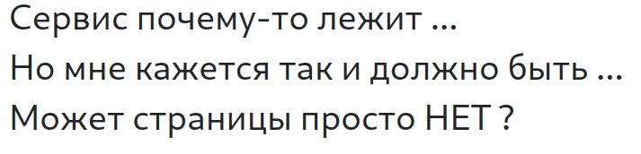
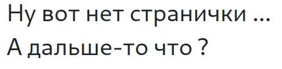

# Присутствие отсутствия: Write-up #

Даже слов нет, одни эмоции... Попробуем открыть хоть что-нибудь: `http://62.173.140.174:16006/index.html`

А дальше ничего, лезем в исходники искать хоть что-нибудь. И находим небольшое отличие: в этой странице, в отличие от предыдущей появилась иконка.

Как говорится в Поступашках: `Если видите что-то необычное, значитъ, неспроста энто...`. Возможно, эта иконка - путь к нашим 400(!) баллам?

`Inspect > Network > F5 > favicon.ico` и иконка скачана. А вот что делать дальше - загадка. Честно говоря, именно этот момент вызвал у меня наибольшую мозговую активность.
Я и в Gimp лез, высматривал там нанопиксели. А потом я вспомнил:

`Чёрт, да это же таск категории ВЕБ, как я мог не догадаться использовать методологию СТЕГИ?!!`

    $ strings -n 7 favicon.ico                                          
    CODEBY{IT IS NOT A FLAG BUT YOU CAN TRY}
    CODEBY{MAYBE LOWER ?}
    CODEBY{1_L0v3_C4ndy}

Флаг, соответственно, самый нижний. Слишком много баллов дают за него, чтобы он был лишь посредственным таском из категории Веб, не так ли?
