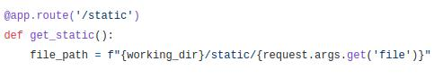

# Обычная страница: Write-up #
Попадая на сайт, нам показывают прикольную гифку и сурсы сайта (весьма опрометчивое решение😏). Больше всего нас интересует этот кусок кода:

Он отвечает за подгрузку файлов из папки static, причём делает это наигрубейшим способом: через `GET-параметр file`. Соответственно, почему бы нам вместо гифки не отрендерить что-нибудь другое, скажем... flag.txt?

Судя по всему, подразумевалось, что `file` будет принимать названия файлов. Но мы можем попытаться добавить к имени файла путь. Т.к. подавляющее большинство серверов - Linux-системы, а такие системы в качестве перехода в папку уровнем выше используют `../`, попробуем засунуть это в параметр.

Из описания мы знаем, что файл с флагом лежит в корне (`/flag.txt`), но не знаем, на каком уровне находимся мы, поэтому на всякий случай наспамим `../` побольше, чтобы точно оказаться в корне:

    http://62.173.140.174:16012/static?file=../../../../../flag.txt

А вот и решение нашей обычной страницы - обычный флаг:

    CODEBY{lf1_vuln_3xpl01t3d}
